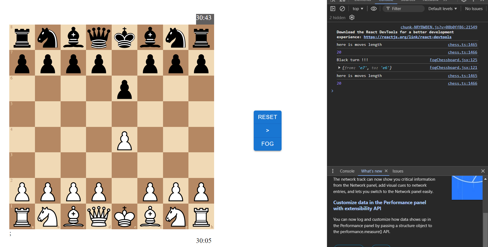

<h1>Chess Engine AI</h1>

## Description

A AI for chess game - can beat Chess.com bots up to 1000 elo

## Techstack

## Set Up

The project is divide into the frontend and backend, each of them has their own chess engine to process

To run the full project go to the frontend directory and run the following command

    npm run all

To run just the frontend, go to the frontend directory and run the following command

    npm run dev

To run just the backend, go to the frontend directory and run the following command

    npm run api

## License

C++ Chess Engine by disservin, all rights remain

Copyright (c) 2023 disservin

Chess.js by Jeff Hlywa, all rights reserved

Copyright (c) 2023, Jeff Hlywa

